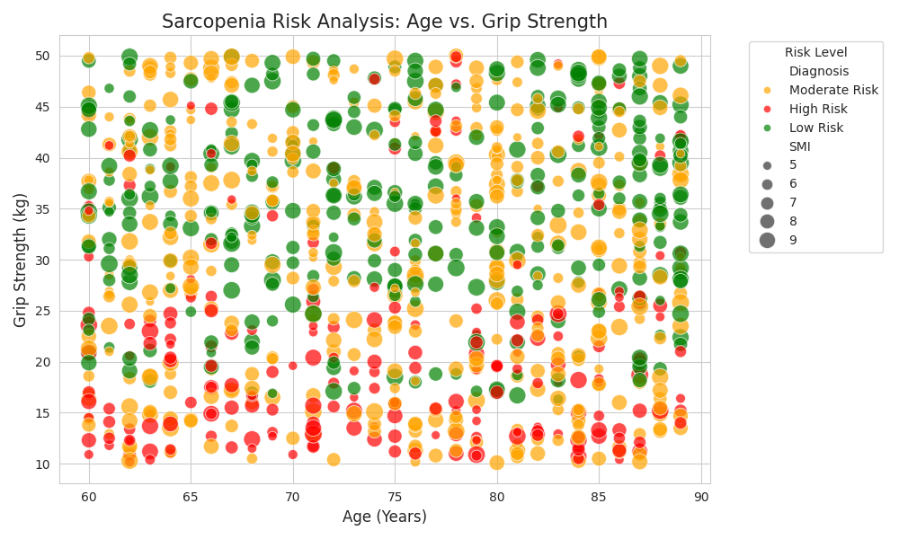

# 💪 AI-Based Sarcopenia Detection System

A machine learning project that predicts the risk of **Sarcopenia** (muscle atrophy) based on clinical data. The system utilizes a Decision Tree algorithm to analyze physiological metrics with **98% accuracy**.



## 🧬 Key Features
* **Synthetic Data Generation:** Simulates clinical data for 1,000 patients (Age, Gender, Grip Strength, SMI, Gait Speed).
* **Diagnostic Logic:** Implements EWGSOP2 guidelines for sarcopenia classification.
* **Machine Learning Model:** decision Tree Classifier trained to predict risk levels (Low, Moderate, High).
* **High Accuracy:** Achieved ~98% accuracy on unseen test data.
* **Explainable AI:** Feature importance analysis identifies **Skeletal Muscle Mass Index (SMI)** as the primary predictor.

## 🛠️ Tech Stack
* **Language:** Python 3.11
* **Libraries:** Pandas, NumPy, Scikit-learn, Matplotlib, Seaborn
* **Environment:** Jupyter Notebook / VS Code

## 🚀 How to Run
1.  Clone the repository:
    ```bash
    git clone [https://github.com/itamar-mizrahi/bioinformatics-project.git](https://github.com/itamar-mizrahi/bioinformatics-project.git)
    ```
2.  Install dependencies:
    ```bash
    pip install -r requirements.txt
    ```
3.  Run the analysis:
    ```bash
    python index.py
    # OR open index.ipynb in Jupyter
    ```

## 📊 Results
The model successfully identifies high-risk patients by correlating low grip strength and low muscle mass, overcoming gender-specific biases in the raw data.
